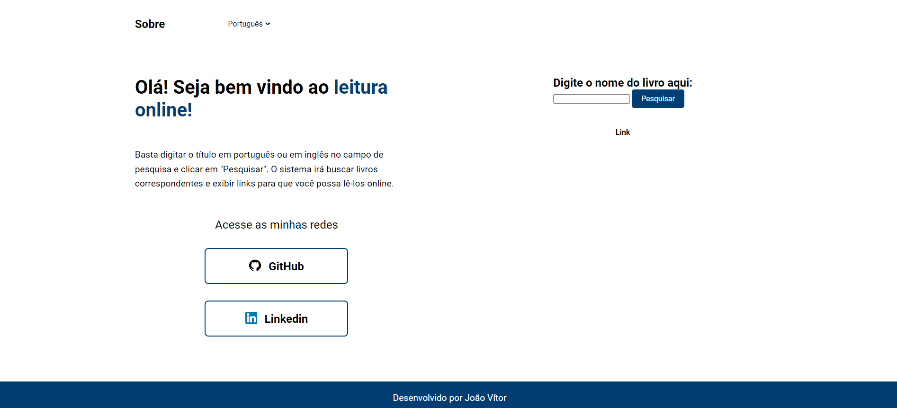

# Leitura Online 👩‍💻

Este repositório contém o código fonte, desenvolvido com **HTML5**, **CSS3**, e **JavaScript**, projetado para funcionar com a API do **[GUTENDEX](https://gutendex.com/)**.

## Funcionalidades ⚒️

- Interface de usuário intuitiva.
- Campos para inserção de nome do livro e recebimento do link.

## Tecnologias Utilizadas 💻

- **HTML5**: Estruturação das páginas.
- **CSS3**: Estilização das telas e layout.
- **JavaScript**: Gerenciamento de eventos, comunicação via API e manipulação do DOM.

## Como Executar o Front-End 🤔

1. **Clonar o repositório:**

   ```
   bash
   git clone https://github.com/euvitorti/readBookOnline.git
   cd nome-do-repositorio-front
   ```

2. Executar o projeto:

   Não é necessário nenhum servidor para rodar o front-end, basta abrir o arquivo index.html no navegador.

## Exemplo de Uso

1. Tela de inicial:

   

## Contribuição 🚀

Sinta-se à vontade para abrir issues e enviar pull requests para contribuir com o projeto.
